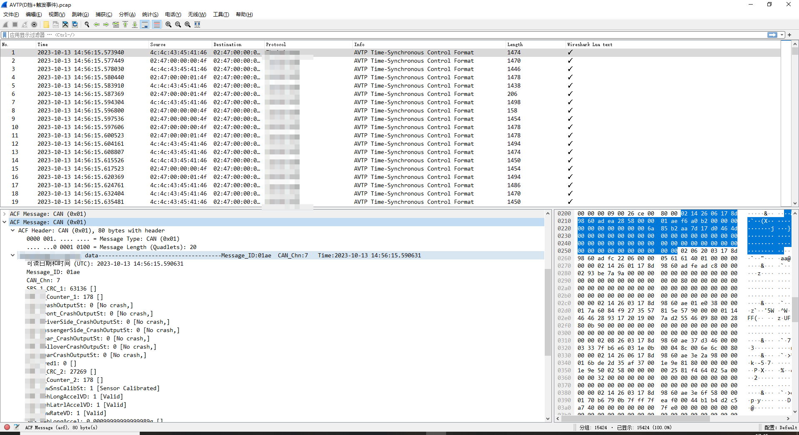

# Wireshark_avtp_plugin
## Introduction
This is a plugin for AVTP Protocal in Wireshark, also you can modify it and using for other protocals(for example TCP, Someip and so on)  
If you want to learn more about building plugins in Wireshark, I recommend reading [Mika's tech blog](https://mika-s.github.io/wireshark/lua/dissector/2017/11/04/creating-a-wireshark-dissector-in-lua-1.html). As far as I know, it is the best tutorial.  

